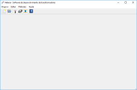
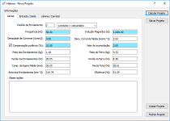
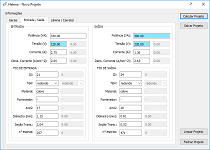
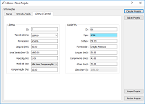
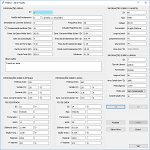
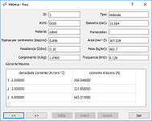
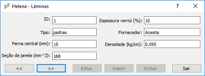
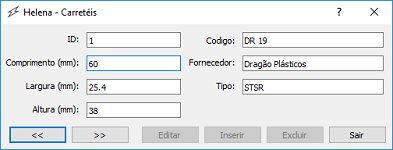

# Helena
### Software to create (mono-phase) transformer project

This project is a software to create (mono-phase) transformer project basead in book ***Transformadores*** of ***Alfonso Martignoni***.

The project need the values:
* Pattern Transform;
* Frequency;
* Magnetic Induction;
* Current Density;
* Loss Compensation in transformer;
* Accomodation;
* Power Output;
* Voltage Output;
* Voltage Input;
* Lamina Type;
* Loss Compensation in lamina;
* Bobbin Type;

***
## Windows

* #### Principal Window

  

* #### General, Input and Output and Lamina and Bobbin Informations Window

  
  
  

* #### Open Project Window

  

* #### Wires Window

  

* #### Laminas Window

  

* #### Bobbins Window

  